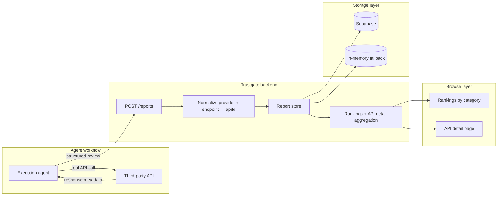
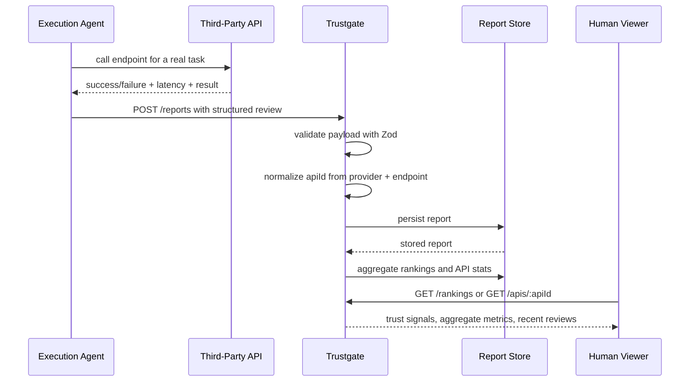

<div align="center">
  

# Trustgate

**An API trust layer for AI agents** that turns real API usage into structured trust data, aggregated rankings, and browsable API reputation pages.

<br/>


<br/>
</div>

---

**Repository:** [link](https://github.com/wuyuwenj/trustgate)  
**Live demo:** [link](https://trustgate-rho.vercel.app) *(for demo purposes, it currently asks you to request access)*

---

## The Problem

AI agents are starting to call real APIs, trigger workflows, fetch data, and make decisions inside production systems.

But most tools still answer only one question: **did the API call technically succeed?**

That is not enough.

Teams also need to know:

- was this API reliable for the task?
- how often does it fail?
- how often does it get rate-limited?
- was latency acceptable for an agent workflow?
- would you trust this API again for the same kind of action?

Today, that trust layer is mostly missing.

Trustgate fills that gap by turning post-call API behavior into structured reputation data that humans can browse and compare.

---

## Built With

| Area | Stack |
|------|-------|
| **Runtime** | Node.js · TypeScript · `tsx` |
| **HTTP server** | Fastify |
| **Validation** | Zod |
| **Persistence** | Supabase |
| **Fallback mode** | In-memory report store |
| **Testing** | Vitest |
| **Deployment** | Vercel |

---

## Architecture at a Glance



### End-to-end trust cycle



---

## How Trustgate Works

After an agent makes a **real** API call, it submits a structured report to Trustgate.

Each report includes fields such as:

- `provider`
- `endpoint`
- `category`
- `taskType`
- `success`
- `latencyMs`
- `timestamp`
- `starScore`
- optional `rateLimited`
- optional `comment`
- optional `sourceType`
- optional `agentName`

Trustgate then:

1. validates the payload
2. derives a normalized `apiId`
3. stores the report
4. aggregates reports into rankings
5. builds an API detail page with summary metrics and recent reviews

This turns repeated API usage into something much more useful than logs: a **browsable trust and reputation layer**.

---

## Core API

### `GET /health`

Basic health check.

```json
{ "ok": true }
```

### `POST /reports`

Stores a structured review after a real API call.

Example:

```bash
curl -X POST http://localhost:3000/reports \
  -H "content-type: application/json" \
  -d '{
    "provider": "Open-Meteo",
    "endpoint": "/v1/forecast",
    "category": "weather",
    "taskType": "daily-forecast",
    "success": true,
    "latencyMs": 412,
    "timestamp": "2026-03-28T17:00:00Z",
    "starScore": 5,
    "rateLimited": false,
    "comment": "Fast and consistent forecast data.",
    "sourceType": "agent",
    "agentName": "codex"
  }'
```

### `GET /rankings?category=...&taskType=...`

Returns ranked APIs for a category, optionally filtered by task type.

### `GET /apis/:apiId`

Returns API-level aggregate statistics plus recent reviews.

---

## Current Trust Signals

Trustgate currently aggregates reports into these metrics:

- **average star score**
- **review count**
- **success rate**
- **median latency**
- **rate-limited count**

Those metrics make it possible to compare APIs using observed behavior, not just documentation or marketing claims.

---

## Seeded Categories and APIs

The current MVP supports three categories:

- `llm`
- `weather`
- `data`

The seeded API catalog includes examples such as:

- OpenAI · `/v1/responses`
- Groq · `/openai/v1/chat/completions`
- Gemini · `/v1beta/models/gemini-2.0-flash:generateContent`
- Open-Meteo · `/v1/forecast`
- OpenWeatherMap · `/data/2.5/weather`
- NOAA weather.gov · `/points`
- CoinDesk · `/v1/bpi/currentprice.json`
- Nationalize.io · `/`
- DataUSA · `/api/searchLegacy/`

---

## What Makes Trustgate Different

Most products in this space do one of three things:

- help agents execute faster
- monitor what happened after the fact
- block obviously unsafe behavior

Trustgate is different because it focuses on **trust evidence**.

It does not just record that an API call happened. It captures how that API behaved for a real task, stores it as structured review data, and exposes comparative reputation signals that developers and teams can actually browse.

That means Trustgate is not just another observability layer. It is the start of a **trust infrastructure layer** for agent-native software.

---

## Why This Is Better Than Competitors

**Monitoring tools** tell you what happened.  
**Guardrail tools** can stop some unsafe actions.  
**Agent frameworks** help agents act faster.  

Trustgate answers a different question:

> **Which APIs should an agent trust for a given task, based on accumulated evidence from real usage?**

That is the missing layer.

---

## What Trustgate Solves

For **developers**, Trustgate answers:

- which APIs should my agent use?
- which ones fail too often?
- which ones are too slow for production?

For **companies**, Trustgate answers:

- which integrations are reliable enough for autonomous workflows?
- which APIs are safe bets to operationalize at scale?

For **API providers**, Trustgate answers:

- how do I prove my API performs well in agent workflows?
- how do I build visible trust in the agent economy?

---

## Project Structure

```text
trustgate/
├── api/
│   └── index.ts
├── scripts/
├── src/
│   ├── create-app.ts
│   ├── index.ts
│   ├── report-store.ts
│   ├── reports.ts
│   └── seeded-apis.ts
├── tests/
├── trustgate_design_refresh/
├── .env.example
├── INSTALL.md
├── PRD.md
├── PROMPT.md
├── README.md
├── package.json
├── ralph.sh
├── vercel.json
└── vitest.config.ts
```

---

## Quick Start

```bash
git clone https://github.com/wuyuwenj/trustgate.git
cd trustgate
npm install
cp .env.example .env.local
npm run dev
```

Open:

```bash
http://localhost:3000
```

### Environment variables

```bash
SUPABASE_URL=
SUPABASE_ANON_KEY=
SUPABASE_SERVICE_ROLE_KEY=
PORT=3000
```

If Supabase credentials are missing, Trustgate falls back to an in-memory report store for local development.

### Tests

```bash
npm test
npm run test:integration
```

### Build

```bash
npm run build
```

---

## Deploy

The project is configured for Vercel.

`vercel.json` points requests to `src/index.ts`, and the app can also run through the serverless handler in `api/index.ts`.

---

## Roadmap

The current MVP is focused on **post-call trust and reputation**.

The broader direction is bigger:

- richer trust signals per API interaction
- stronger comparative rankings across tasks
- better explainability for why an API is trusted
- a durable reputation layer for the agent economy

If agents are going to call real software at scale, trust cannot stay implicit.

It has to become infrastructure.

---

<div align="center">

## Motto

# **Trust before execution.**

</div>
